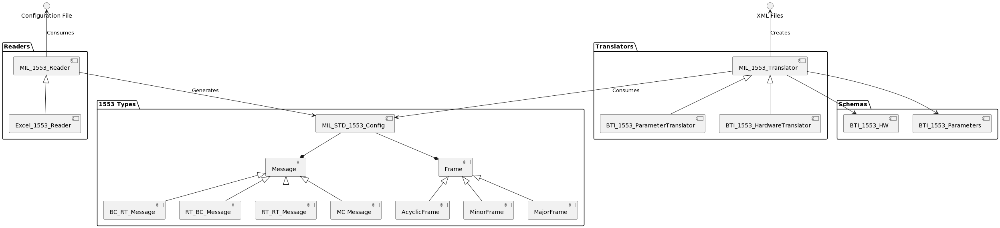

# 1553-Configurator

The 1553-Configurator project aims to simplify the process or generating the XML files necessary to configure the [Ballard MIL-STD-1533 Custom Device](https://github.com/ni/niveristand-ballard-milStd1553-custom-device) in your NI VeriStand project. Rather than using multiple tools or manually generataing XML, the 1553-Configurator tools consume a single configuration file which defines all of the 1553 messages and frames and generates both the hardware and parameter XML files.

The general project structure is shown below. The goal of this structure is to be flexible in both the initial configuration file and the potential output XML structures (i.e. to generate AIM XML files).



## Installation

This project uses poetry to manage dependencies and various development tasks. After installing poetry run the following command to install the required packages to your virtual environment.

```bash
poetry install
```

After all packages have been installed, unit tests can be run with the following command.

```bash
poetry run pytest
```

## Usage

Below is a very simple script for generating XML strings. An example conifguration file is located at `./docs/example configurations/1553Config.xlsx`

```python
from vs_1553_configurator.readers import Excel_1553_Reader
from vs_1553_configurator.translators import BTI_1553_HardwareTranslator, BTI_1553_ParameterTranslator

# Get path to config file
config_path = "<ExampleConfigs>/1553Config.xlsx"

# Load config
reader = Excel_1553_Reader(config_path)

# Translate configs
parameter_translator = BTI_1553_ParameterTranslator(reader.config)
hw_translator = BTI_1553_HardwareTranslator(reader.config)

parameters_xml = parameter_translator.generate_parameters_xml()
hw_xml = hw_translator.generate_hw_xml()
```

## Contributing

Pull requests are welcome. For major changes, please open an issue first
to discuss what you would like to change.

Please make sure to update tests as appropriate.

## License

[MIT](https://choosealicense.com/licenses/mit/)